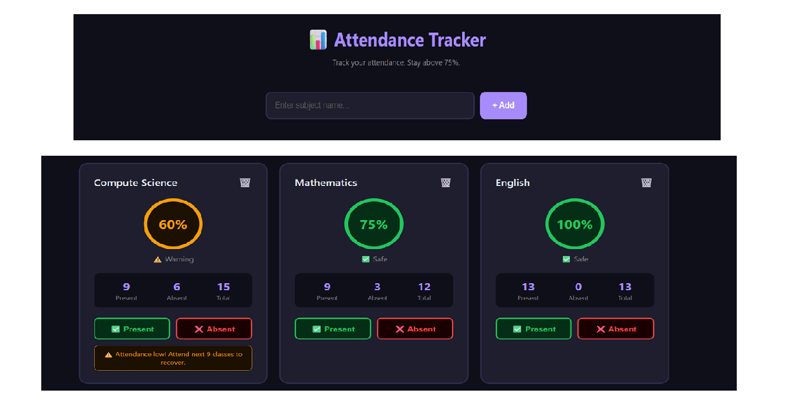

# 📊 Student Attendance Tracker

A clean and responsive web app to track your college subject attendance. 
Stay above 75% and never get detained!

## 📸 Screenshot

## ✨ Features
- Add unlimited subjects
- Mark Present or Absent with one click
- Live attendance percentage per subject
- Color coded status — Green (Safe), Yellow (Warning), Red (Danger)
- Warning alert when attendance drops below 75%
- Critical alert when attendance drops below 60%
- Overall attendance summary dashboard
- Data saves automatically — works even after closing the browser

## 🎯 Attendance Status
| Percentage | Status |
|------------|--------|
| 75% and above | ✅ Safe |
| 60% - 74% | ⚠️ Warning |
| Below 60% | 🚨 Critical |

## 🛠️ Tech Stack
- HTML
- CSS
- JavaScript
- LocalStorage (for saving data)

## 🚀 How to Run
1. Clone the repository
2. Open `index.html` in any browser
3. Add your subjects and start tracking!

## 💡 Why I Built This
As a college student, keeping track of attendance across multiple 
subjects is stressful. This app solves that problem with a clean 
dashboard that gives instant visual feedback on your attendance status.

## 👨‍💻 Author
**Zayeem Ajaj Sayyed**  
BBA (Computer Applications) — Foresight College, Pune  
[GitHub](https://github.com/ZayeemSayyed)
